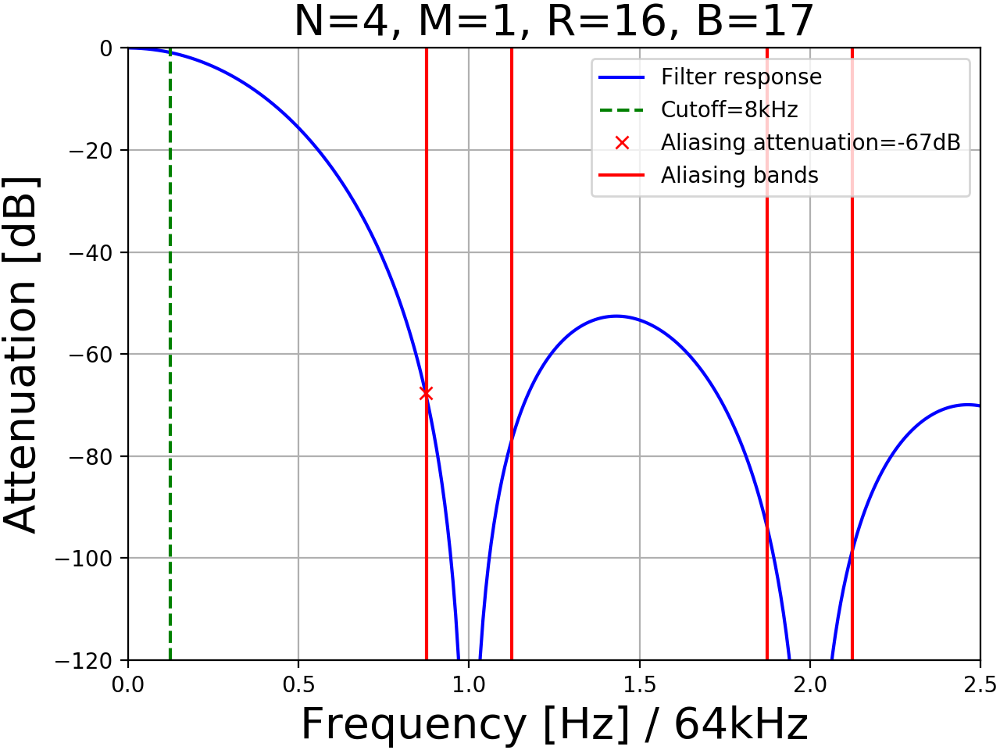
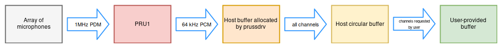

# Audio processing on the BeagleBone Black's Programmable Real-time Unit

## Introduction / Motivation

The goal of this project is to implement audio processing using one of the BeagleBone Black's PRU microprocessors along with a C API built around it to make it easily usable as a simple C library. The input signals come from 6 Knowles SPM1437HM4H-B microphones connected to the board, each with a 1-bit wide signal (Pulse Density Modulation, more on that later).

The audio processing code currently handles the 6 microphones at a fixed output sample rate, using one of the 2 PRUs present on the board. For now, the API is very simple. It allows the user to read the processed data from the PRU to a user-supplied buffer, specify the quantity of data needed and the number of channels to extract from it. It also allows the user to pause and resume the recording of the data on the API side, to prevent overflows in case the user wants to momentarily stop reading data.

Running the core audio processing code on the PRU instead of the main ARM CPU allows for lower latency due to the PRU's predictable timing and it not being subject to OS scheduling like a typical Linux process running on the ARM CPU would be. Offloading the ARM CPU from such an intensive task also prevents our library from having a significant impact on the global performance of the host when it is used.

The code and documentation can be found here : [https://github.com/Scrashdown/PRU-Audio-Processing](https://github.com/Scrashdown/PRU-Audio-Processing).

## PRU / PRUSS

The PRUSS is a module of the ARM CPU used on the BeagleBone Black. It stands for PRU SubSystem, where PRU stands for Programmable Real-time Unit. The PRUSS contains 2 PRUs which are essentially very small and simple 32-bit microprocessors running at 200 MHz and using a custom instruction set. Each PRU has a constant 200 MHz clock rate, 8 kB of instruction memory, 8 kB of data memory, along with 12 kB of data memory shared between the 2 PRUs. They can be programmed either in assembly using the `pasm` assembler or in C using the `clpru` and `lnkpru` tools.

Each PRU has 32, 32-bit registers, where R30 is used for interacting with the PRU's output pins and R31 is used for reading inputs from these pins and triggering interrupts by writing to it. Both PRUs also share 3 registers banks, also called scratchpads, which are banks containing 30 additional registers. Registers can be transferred in and out between these banks and each PRU in one cycle by using specialized assembly instructions (`XIN` / `XOUT` / `XCHG`, commonly called `XFR` instructions in the PRU Reference Manual). Furthermore, one PRU can also access the registers of the other PRU using the same assembly instructions.

The PRUs are designed to be as time-deterministic as possible. That is, pretty much all instructions will execute in a constant number of cycles (usually 1, therefore in 5 ns at the 200 MHz clock rate) except for the memory instructions which may vary in execution time.

The PRUSS also contains an interrupt controller which allows the PRU to send and receive interrupts to and from the ARM CPU. It can be configured either from the PRUs themselves by changing the values of the configuration registers, or from the ARM CPU using the `prussdrv` library along with the `uio_pruss` driver (more information on that below).

Using the PRUSS requires a driver. Currently, there are 2 choices available : `uio_pruss` (along with the `prussdrv` library) and the newer `pru_rproc`. `uio_pruss` provides a lower level interface than `pru_rproc`. `pru_rproc` provides a C library for message passing between the PRU and the ARM CPU which makes programming simpler than with `uio_pruss`. However, the current lack of examples online for using `pru_rproc`, along with performance issues encountered using it for this project, made us choose `uio_pruss` instead.

That said, it seems `uio_pruss` is currently being phased out of support by Texas Instruments in favor of `pru_rproc`. It may be feasible in the future to convert the code to use `pru_rproc`. However, as we are going to see further in the report, the timing requirements in the PRU processing code are very tight, even using assembly. Whether it would be possible to meet them using C and `pru_rproc` has yet to be investigated.

## Audio Processing

As mentioned earlier, we are using microphones with a 1-bit wide output at a very high sample rate (> 1 MHz). The signal these microphones input is a PDM (Pulse Density Modulation) signal which is of an unusual type and needs to be converted to a lower-rate PCM (Pulse-Code Modulation) signal, which is much more commonly used for storing audio data.


In a PCM signal, each value represents its amplitude on a fixed scale at a fixed time. However, in a PDM signal, its amplitude at a given time is represented by the density of 1's relative to 0's at the said time. Converting a PDM signal to a PCM signal therefore requires using some kind of a moving-average filter.

### CIC Filter

Because we wanted to run this filter on the PRU with rather tight timing constraints, we chose to implement a CIC filter. CIC stands for Cascaded Integrator-Comb filter. There are two general types of CIC filters : the decimation filters, which are the type we're using in this project, and the interpolation filters. From now on we will call CIC decimator filters simply CIC filters.

It is essentially an efficient implementation of a moving-average filter which uses only additions and subtractions and also has a finite impulse response (FIR). Although the PRU is capable of performing unsigned integer multiplications (required by other types of FIR filters) by using its Multiply and Accumulate Unit, they take several more cycles to execute than the one-cycle instructions used for regular additions and subtractions. Since our goal is to handle several channels at once with very tight timing constraints, computational savings really matter.

A CIC filter also has a drawback however. Its frequency response is far from the ideal flat response with a sharp cutoff we would like to have. To get a sharper cutoff, it is necessary to append another filter to it, commonly called a compensation filter. That said, since a CIC filter's output is usually at a much lower rate (64 kHz for now) than its input (~ 1.028 MHz), applying this filter after the CIC one will require much less computational resources than applying it on the raw, very high rate input signal from the microphones.

In general, CIC filters are well suited as an efficient first filtering step, which efficiently downsamples the signal and gets rid of some of the higher frequencies. The reduced sample rate of the output reduces the computational power needed for additional FIR compensation filters, and therefore compensates their higher complexity.



Now let's dive into more detail about the CIC filter. The filter has 3 parameters : N, M, and R. It is made of N cascaded integrator stages, followed by a decimator of rate R, and then N cascaded comb stages, where M is the delay of the samples in the comb stages. It takes a PDM signal as input and outputs a PCM signal. If the input sample rate is `f_s`, the output sample rate will be `f_s / R`. A CIC interpolation filter is very similar, except the comb stages come first, followed by an interpolator of rate R, and finally the integrators.


The filter's resource usage depends on its parameters, the platform on which it is implemented and how it is implemented. More detailed explanation will follow in the implementation section of this report. However, by considering only the theoretical structure of the filter, we can already deduce some general rules :

* Memory usage is approximately proportional to N and M : The filter has N integrator stages and N comb stages of which we need to store the values, therefore memory usage is approximately proportional to N. Also, since M is the delay of the samples in the comb stages, for each comb stage it is necessary to store the previous M samples, therefore memory usage is approximately proportional to M.
* Computational resource usage is inversely correlated to R : Since the comb stages are preceded by a decimator of rate R, the comb stages need to be updated R times less often than the integrator stages. Therefore, as R increases, less computational power is required by the comb stages. However, the reduction cannot be arbitrarily high, because the integrator stages always need to be updated at the very high input sample rate, independently of R. The processing power needed for these stages, and any other overhead added by the implementation, constitute therefore a lower-bound of the total processing power required to run the filter.

Finally, some important things to know about CIC decimation filters is that overflows will occur in the integrator stages. However, the output of the filter will still be correct if each stage follows modular arithmetic rules (PRU registers do, since they can overflow and loop back to zero) and if each stage has a bit width large enough that it can support the maximum value expected at the end of the filter. To check the second condition, a formula exists to find out about the required bit width of the stages for the filter to be correct (described in Hogenhauer's paper) :

$$B_{out} = \lceil Nlog_2(RM) + B_{in} \rceil$$

Where $B_{in}$ is the bit width of the filter's input (in our case 1 bit), M, N and R are the filter's parameters, and $B_{out}$ is the required bit width for all stages of the filter.

## Documentation

### Getting Started

First of all, make sure you have the required hardware: the BeagleBone Black, an SD card, and the Octopus Board. Flash the board with the latest "IoT" Debian image following these [instructions](https://beagleboard.org/getting-started).


#### Configure `uio_pruss` and free the GPIO pins for the PRU

*Note: this was tested on this kernel:* `Linux beaglebone 4.4.91-ti-r133 #1 SMP Tue Oct 10 05:18:08 UTC 2017 armv7l GNU/Linux`

In order to run the filter, we need to be able to use the input and output pins from the PRUs to be able to read data from the microphones. Some of them can be multiplexed to the PRUs. However, by default, some pins cannot be reassigned to something else. To correct this, we need to load a [cape](https://elinux.org/Capemgr). To do so, open the `/boot/uEnv.txt` file on the board (backup it first!) and do the following modifications, then reboot :

Add the following line :

    cape_enable=bone_capemgr.enable_partno=cape-universala

And comment the following line :

    enable_uboot_cape_universal=1

You should now be able to multiplex a pin to the PRUs using the `config-pin` command (see these [instructions](Documentation/pins.md) for more details). We still have to enable the UIO driver, which is disabled in favor of `pru_rproc` on this kernel. To do so, still in the `/boot/uEnv.txt` file, comment that line :

    uboot_overlay_pru=/lib/firmware/AM335X-PRU-RPROC-4-4-TI-00A0.dtbo

And uncomment this one :

    uboot_overlay_pru=/lib/firmware/AM335X-PRU-UIO-00A0.dtbo

Then :

    $ cd /opt/source/dtb-4.4-ti
    $ sudo nano src/arm/am335x-boneblack.dts

Comment that line :

    #include "am33xx-pruss-rproc.dtsi"

And uncomment this one :

    #include "am33xx-pruss-uio.dtsi"

Then close nano and run the following commands :

    $ make
    $ sudo make install

This is the final step. Run `sudo nano /etc/modprobe.d/pruss-blacklist.conf` and add the following lines :

    blacklist pruss
    blacklist pruss_intc
    blacklist pru-rproc

Now reboot the board, and you should be able to run commands such as `config-pin -q P8.45` without trouble.


#### Install PRUSS Driver Library (`prussdrv`) and PRU Assembler (`pasm`)

In order to install the PRUSS driver on the host side, first clone this [repo](https://github.com/beagleboard/am335x_pru_package). Then `cd` into the cloned repository and run the following commands :

    $ make
    $ sudo make install
    $ sudo ldconfig

If everything went well, the `prussdrv` library and the `pasm` assembler should be installed on your board and ready to be used.

#### Plug the Octopus board and write some code!

The code for the CIC filter and the interface can be found in `src/6Mic-CIC/`. To write and run some code like the one below, write it to a file called `main.c` in `host/`, then run `sh deploy.sh`, `cd gen/` and `./main`.

```C
/* Example code for using the library. */
#include <stdio.h>
#include <stdlib.h>
#include <time.h>

#include "interface.h"

#define OUTFILE "../output/interface.pcm"
#define NSAMPLES 64000
#define NCHANNELS 6

int main(void) {
    FILE * outfile = fopen(OUTFILE, "w");
    void * tmp_buffer = calloc(NSAMPLES, NCHANNELS * SAMPLE_SIZE_BYTES);
    pcm_t * pcm = pru_processing_init();
    
    struct timespec delay = { 1, 0 };
    enable_recording();
        nanosleep(&delay, NULL);
    disable_recording();

    pcm_read(pcm, tmp_buffer, NSAMPLES, NCHANNELS);
    pru_processing_close(pcm);

    fwrite(tmp_buffer, NCHANNELS * SAMPLE_SIZE_BYTES, NSAMPLES, outfile);

    fclose(outfile);
    free(tmp_buffer);
    return 0;
}

```

### Microphones and wiring diagram


For this project, we are using the Knowles SPM1437HM4H-B microphones which output a PDM signal at a very high frequency (> 1 MHz), see the microphone's data sheet in the documentation for more details. They have 6 pins :

* 2 x **GROUND** (power) : Ground
* **VDD** (power) : VDD
* **CLOCK** (input) : The clock input, must be at a frequency > 1 MHz to wake up the microphone. Dictates the microphone's sample rate, `f_s = f_clk`.
* **DATA** (output) : The microphone's PDM output. Its sample rate equals that of the CLOCK signal. The DATA signal is ready shortly after the rising or falling edge of the CLK. This delay is variable, but is between 18 ns and 125 ns. It is designated in the documentation as `t_dv`.
* **SELECT** (input) : Selects whether data is ready after rising or falling edge of CLOCK, (VDD => rising, GND => falling).

The BeagleBone Black already has pins for GND and VDD, we connect them directly to the corresponding pins on the microphones.

The CLK signal is generated using one of the BeagleBone's internal PWM which is output to one of the board's pins and is configured by a bash script to generate an appropriate CLK signal for the microphones. In our implementation, the PRU's also need to be able to poll the state of the CLK signal. In order to achieve this, the PWM (CLK) signal is also connected to some of the BeagleBone's pins, which are multiplexed to the PRU.

The DATA pin of the microphone is then connected to a pin of the board which is multiplexed to the PRU.


Since we are using 6 microphones, we could use 6 pins on the board for the microphone's DATA outputs, however it is possible to connect 2 microphones per board's pin. To achieve this, we set one of the SELECT lines of the microphones to 2 different values. By doing this, one of the microphones will have data ready just after the rising edge of the input clock, while the other one will have data ready just after the falling edge. In order to avoid a short circuit between the 2 microphones connected to the same pin, it is necessary to place a resistor between each microphone and the pin.

Doing this has a drawback however, for each round of processing (processing all the channels) we need to wait for `t_dv` twice instead of only once with the 'simple' solution using 6 pins. This is because in this case, to retrieve data from all microphones, we have to wait for the rising edge and the falling edge of the clock. According to the microphone's datasheet, `t_dv` can go up to 125 ns, which is 25 cycles of the PRU at its 200 MHz clock rate. Although not a huge advantage in performance it is still significant. However, the current Octopus board uses the 3 pins for 6 microphones, so we have to deal with this drawback.


### Overview of the whole processing chain



### Core processing code

The core audio processing code, which implements the CIC filter, is running on the PRU and handles the tasks of reading the data from the microphones in time, processing all the channels, writing the results directly into the host's memory (where a fixed size buffer has been allocated by `prussdrv`) and interrupting the host whenever data is ready to be retrieved by the host from its buffer. It is written exclusively in PRU assembly (`pru1.asm` in the project files). The CIC filter parameters chosen were `N = 4`, `M = 1` and `R = 16`.

For performance reasons, the PRU uses registers to store the data of each stage of the filter. Because the PRU only has 30 available registers for storing data, it needs to use registers from the scratchpads as well. It does so by exchanging some of its registers with the scratchpads using the XIN and XOUT instructions. We have to keep track of several different counters along the way, and also do the correct register exchanges with the scratchpads to keep any data from being overwritten. The counters are needed for implementing the decimator, waiting for `t_dv` and keeping track of how many samples have been written to the host's memory, so that it can be interrupted when some data is ready.

Since we are using the Octopus board, we have to read data at every edge of the clock. The processing is done in several steps :

* Read data from channels 1-3, process it and output the results to the host buffer. Details :
    * Load chan. 1, 2 registers from BANK0 (scratchpad).
    * Wait for rising edge, then wait for chan. 1, 2 data.
    * Read chan. 1, 2 input data.
    * Perform one iteration of the filter.
        * If the oversampling counter reached R, execute the comb stages and store chan 1, 2 outputs in registers.
    * Store chan. 1, 2 registers to BANK0 and load chan. 3 from BANK1.
    * Read chan. 3 input data.
    * Perform one iteration of the filter.
        * If the oversampling counter reached R, execute the comb stages and store chan 3 output in a register.
    * Write chan. 1-3 outputs to host buffer.
    * Store chan. 3 registers to BANK1.
* Same for channels 4-6. Details :
    * Load chan. 4, 5 registers from BANK1 and BANK2.
    * Wait for rising edge, then wait for chan. 4, 5 data.
    * Read chan. 4, 5 input data.
    * Perform one iteration of the filter.
        * If the oversampling counter reached R, execute the comb stages and store chan 4, 5 outputs in registers.
    * Store chan. 4, 5 registers to BANK1 and BANK2 and load chan. 6 from BANK2.
    * Read chan. 6 input data.
    * Perform one iteration of the filter.
        * If the oversampling counter reached R, execute the comb stages and store chan 6 output in a register.
    * Write chan. 4-6 outputs to host buffer.
    * Store chan. 6 registers to BANK2.
* Increment the written bytes counter. If the end of the buffer has been reached, send interrupt 1 to the host and start writing to the beginning of the buffer again. If the middle of the buffer has just been reached, send interrupt 0 to the host and continue writing.
* Loop back to the beginning.

In order to allow the host to retrieve all the samples before the PRU overwrites them with new data, we have the PRU trigger an interrupt whenever it reaches the middle of the buffer, or the end. These interrupts have different codes which allows the host to tell which half of the buffer contains fresh data. This way, the host can be sure to read one half of the buffer while the other half is being overwritten by the PRU.


As mentioned above, multiplexing 2 microphones on 1 input pin reduces the available processing time, as can be seen on the diagrams above.


Reading the microphones' data is achieved by reading bits of the R31 register, which is connected to the PRU's input pins, to which the microphones' DATA lines are connected. Since we connected the microphones' clock to one of the input pins of the PRU as well, reading its state is done the same way. In order to know when to read the data, the PRU polls the CLK signal until it detects an edge. It then waits for 25 cycles (`t_dv`) and finally reads the data and stores it in a register.

This register is the first integrator in the CIC filter and all subsequent integrators can be updated. Once this is done, the decimator is implemented by using a counter. The uses that counter to determine whether it is time to update the comb stages or not. Once the comb stages are updated, some of the results of the CIC filter are ready and are written to the host's memory.

#### Usage of resources depending on the CIC filter parameters `N`, `M`, `R` and on the number of channels `C`

In the current design, we use only registers to store all values involved in the CIC filter computation. Each PRU has 32 registers `(r0-r31)`, but in practice only 30 are usable. This is because `r30` and `r31` are reserved for interacting with GPIO and triggering interrupts.

Furthermore, since we use the PRU's 3 additional register banks, we cannot use all the bits of `r0`, because the value of the first byte of `r0` is used as an offset value for register exchanges with the banks.

Another thing we need to take into account is that, apart from channel private data (values involved in the CIC filter computations for each channel), we also need to keep track of some channel _independent_ data : a byte counter to keep track of the number of bytes written in the host buffer, a sample counter to implement decimation, the host buffer's size and address and temporary values used for delaying and processing input. This data has to stay on the PRU at all times.

We can fit the decimation counter in a single byte, as long as it does not exceed 255. However, the byte counter needs a complete register. The host's buffer size and address also each need one complete register. Finally, to store the temporary values that are a delay counter and the state of the PRU input pins.

Also, in our implementation, even though we have 6 channels, we only have 3 output registers. After filling the 3 registers, their contents are written to the host buffer and they can be used to store new inputs.

We store all this information on PRU1 the following way :

* **r0** : scratchpad offset (bits 0-7), decimation counter (bits 8-15), delay counter / temporary storage for inputs (bits 16-31)
* **r23, r24, r25** : temporary storage for outputs of the filter, could be only one register, but this would add more memory operations which would add overhead
* **r26** : host buffer size
* **r27** : host buffer physical address
* **r28** : written bytes counter

The remaining registers are used for storing channel private data. In order to figure out how many registers we need for this, assuming one register is wide enough to hold the expected values (see the formula above to check the required bit width), we can use the following formula `(M = 1)` :

	n_reg_private = C * (N + 1 + N - 1 + N - 1) = C * (3N - 1)

With `M != 1`:

	n_reg_private = C * (N + 1 + 2M * (N - 1))

Where C is the number of channels, N and M are the parameters of the CIC filter. It is therefore obvious that `R` has no influence on the filter's register usage. However, `R` influences the filter's output data rate. In our case, `C = 6`, `M = 1`, `N = 4` and `R = 16`, so `n_reg_private = 66`.

> Note that different parameters may allow for fitting more than one channel in a single register, which would change the above formula and dramatically reduce the amount of registers needed.

This, along with the 7 registers holding channel independent data on PRU1, gives us the total register usage :

    n_reg_tot = C(3N - 1) + 7 = 66 + 7 = 73

##### Total number of registers required given `N` and `C` (`M = 1`) (assuming bit width of 32 is enough)

|       | N | 1 | 2 | 3 | 4  | 5 |
|---    |---|---|---|---|--- |---|
| **C** |   |   |   |   |    |   |
| **1** |   | 9 |12 |15 | 18 |21 |
| **2** |   |11 |17 |23 | 29 |35 |
| **3** |   |13 |22 |31 | 40 |49 |
| **6** |   |19 |37 |55 | 73 |91 |
| **8** |   |23 |47 |71 | 95 |119|

An important thing to note is that the PRU is supposed to support the XCHG instruction, which exchanges registers from the PRU to one of the banks in one cycle. Unfortunately, it does not work. Only the XIN and XOUT instructions currently work. This means that we always need to keep `n_reg_private` (11) registers free to act as a temporary storage place. The PRU's registers handle this task.

With the current parameters, storing all data on the PRU leaves one free register : r29. Registers r1-r22 are used for channel private data and are the ones exchanged with the scratchpads.

We also want to figure out the data rate of the filter's output. To do this, using the formula desribed earlier, we first compute the output bit width `B_out`. In our case, `B_in = 1`, so `B_out = 17`. However, the PRU's registers are 32 bits wide and it is more convenient to write the data in 32 bits chunks. Therefore, our 'effective' output bit width, `B_out'` is 32. Since we know the output sample rate is `f_s / R`, it is now straightforward to compute the output data rate :

	D_out = B_out * f_s / R

Or using the `B_out'` :

	D_out' = B_out' * f_s / R

In our case, `f_s ~= 1.028 MHz`, `R = 16` and `B_out' = 32`, which gives `D_out' = 2.056 Mb/s = 257 kB/s`.

##### Output data rate (kB / s) for 1 channel, given `R` (`M = 1`, `B_out' = 32`)

|        |  `D_out' (kB / s)`  |
|---     |:---:|
| **R**  |     |
| **16** |  257  |
| **32** |  128.5  |
| **48** |  85.7  |
| **64** |  64.3  |

#### 1-channel "proof of concept" program

Before writing the 6-channels CIC filter and the C host interface, we wrote a simple, 1-channel, proof of concept program implementing a CIC filter. We then used this code as a base and adapted it for the 6-channels implementation. It can be found in `src/1Mic-CIC/` and run with `sh deploy.sh`. This will start recording from the microphone connected to P8.28 on the BeagleBone and then output the raw resulting PCM to a file in the `src/1Mic-CIC/output/` directory.

It follows the same basic principles as the 6-channels implementation, without scratchpad register exchanges, and waiting for only 1 channel instead of 6.

This implementation works and allowed us to have an idea of how the output of a channel sounds like with different parameters. The PCM signal can be converted to a wav file using the `PCMtoWAV.py` script in `wav_conv/`.

### Host interface and API

The host interface is written in C in the `interface.h` and `interface.c` files. It is currently very simple and provides the following functions :

```C
/**
 * @brief Very basic interface for reading audio using the PRU firmware.
 * 
 */

#include "ringbuffer.h"
#include "loader.h"

#define SAMPLE_SIZE_BYTES 4

typedef struct pcm_t {
    // Number of channels
    size_t nchan;
    // *Per-channel* sample rate of the PCM signal in Hz
    size_t sample_rate;
    // The buffer accessed by the PRU, mapped by prussdrv, and its length
    volatile void * PRU_buffer;
    // Length of the aforementioned buffer
    unsigned int PRU_buffer_len;
    // The ring buffer which is the main place for storing data
    ringbuffer_t * main_buffer;
} pcm_t;

/**
 * @brief Initialize PRU processing. 
 *        Must be called before any other function of this file.
 * 
 * @return pcm_t* A pointer to a new pcm object in case of success, NULL otherwise.
 */
pcm_t * pru_processing_init(void);

/**
 * @brief Stop processing and free/close all resources.
 * 
 * @param pcm The pcm object containing the resources.
 */
void pru_processing_close(pcm_t * pcm);

/**
 * @brief Read a given number of blocks of given size 
 *        and output them to the user provided buffer.
 * 
 * @param src The source pcm from which to read.
 * @param dst The buffer to which we want to write data.
 * @param nsamples The number of samples to read from each channel.
 * @param nchan The number of channels to read.
 * @return int The number of samples effectively written.
 */
size_t pcm_read(pcm_t * src, void * dst, size_t nsamples, size_t nchan);

/**
 * @brief Get the current length of the circular buffer holding the recorded samples.
 * 
 * @param void 
 * @return size_t The length of the buffer.
 */
size_t pcm_buffer_length(void);

/**
 * @brief Get the max length of the circular buffer holding the recorded samples.
 * 
 * @param void 
 * @return size_t The max length of the buffer.
 */
size_t pcm_buffer_maxlength(void);

/**
 * @brief Enable recording of the audio to the ringbuffer.
 * 
 * Once this function is called, the interface will start copying
 * from the buffer the PRU writes to, to the main ringbuffer of the interface. 
 * In order to avoid a ringbuffer overflow, the user must therefore start 
 * reading using pcm_read quickly after this function had been called.
 * 
 */
void enable_recording(void);

/**
 * @brief Disable recording of the audio to the ringbuffer.
 * 
 * Once this function is called, the interface will stop copying data 
 * to the main ringbuffer. This means only the samples remaining in 
 * the ringbuffer after this function was called can be read.
 * 
 */
void disable_recording(void);
```

The host interface contains several components. The first is a special buffer in the host memory allocated by `prussdrv` which the PRU directly writes to. It contains the data computed by the PRU for all channels. The second component is a larger circular buffer which serves as the main temporary buffer of the interface.

When the `pru_processing_init()` function of the API is called, it loads and starts the PRU firmware, and starts a separate thread which handles the recording the samples from the PRU buffer to the bigger circular buffer of the interface. Everytime the PRU has finished writing one half of this buffer, it sends an interrupt to the host and starts writing to the other half. The code of the interrupt sent designates which half of the buffer was filled with fresh data.

This thread essentially waits alternatively for each interruption and then copies the corresponding buffer half to the circular buffer. Waiting for each interrupt alternatively makes sure the host cannot get desynchronized and start writing the buffer halves that are being overwritten by the PRU. However, this mechanism cannot detect whether a buffer half has been skipped. This can happen if the host is too busy with other programs which can make it miss an interrupt by the PRU. Furthermore, if an interrupt is missed, the next one will be skipped as well, since we wait for them alternatively. Therefore if an interrupt is missed, 2 buffer halves will actually be missed. We chose to use this mechanism because of its simplicity, and because it did not require the PRU to count the buffer halves it filled and output the number to the host regularly. This would however be a better solution.

The circular buffer is similar to a queue but with a fixed length. Its API provides functions for pushing and popping data from it. In the case of an overflow, the push function will only trigger a warning and overwrite the oldest data in the buffer.

The `pcm_read` function provided by the API pops the number of samples required by the user from the circular buffer, then extracts only the number of channels the user asks for, and finally outputs this data to the user provided buffer.

It is important to note that there will be concurrent accesses to the circular buffer : data pushed by the recording thread, and data popped by the user thread calling the `pcm_read` function. Our implementation handles this by making accesses mutually exclusive by using a mutex declared in the `interface.c` file. This is a simple but far from ideal solution. For example, if a call to `pcm_read` pops a large chunk of data from the circular buffer, this may block the recording for a long enough time that it will miss the next interrupt, and therefore a large chunk of samples.

## Results

### Single channel implementation

The single channel implementation works and shows that it is possible to implement a CIC filter on the PRU and rely on PRU writes to the host memory. With the following parameters (N = 4, M = 1, R = 16), we were able to get a moderately noisy but intelligible signal at a sample rate of 64 kHz.

It is worth noting that using one channel, the timing constraints are much less tight since there is much less processing to be done. This leaves more freedom in choosing the parameters. For example, higher input sample rates (compared to the 6-channel 1.028 MHz) are achievable.

### 6-channels implementation with C Host interface

At the time of writing this report, the 6-channels implementation works.

The C interface has been tested recording samples for up to 5 minutes and appears to work.

We have noticed that some occasional glitches appeared in the signal while using a microphone connected using a breadboard and soldered by hand. However, these glitches seem to have disappeared when we started using the Octopus Board.

More rigorous testing needs to be done to make sure the PRU processing code and the interface work as intended.


## Challenges faced

### Lack of documentation and the existence of 2, different drivers

The biggest challenge faced in this project is probably the lack of clear and organized documentation about how to run code on the PRU from the Linux host, how to configure the operating system so that the BeagleBone's pins can be multiplexed to the PRU, how to choose which driver to use, and finally how to configure the BeagleBone for it to work. Most of the documentation and examples are scarce, sometimes outdated and scattered across multiple websites which forced us to do a lot of trial and errors on things such has how to enable drivers or the right interrupts between the host and the PRU.

Apart from the fact that embedded systems is an inherently tough subject that is by far not as popular as more high level programming is (especially about the PRU, which seems to be a piece of hardware very few people use or know about), I think the scarcity of the documentation is probably the greatest factor that makes the learning curve for this project rather steep.

### Limited number of registers and tight timings

On a more technical point of view, processing six channels simultaneously on one PRU is feasible, but challenging in terms of resource management. In our current implementation of the 6-channels CIC filter on the PRU, all operations required for processing one sample from each channel must execute in less than 144 cycles. All except one the PRU's registers are used, and the majority of the banks' registers are used as well.

This 'shortage' of registers on the PRU forced us to write each set of 6 samples in 2 steps of 3 registers and was the source of a bug : the byte offset counter used by the PRU to keep track of where it is writing in the host buffer was updated incorrectly. We incremented it by 6 * 4 bytes once instead of incrementing it by 3 * 4 bytes twice, which discarded the first 3 channels by overwriting them with the last 3 ones.

Another challenge was to design the program such that it would not rely on the host too much because of its unpredictable timings and busy nature. Below is an example of a bug that happened when the host was in charge of retrieving a new sample everytime it was ready (with these parameters, 64000 times per second). The host couldn't keep up and missed many samples, resulting in this quite weird looking (and sounding) timing diagram.


## Possible improvements and additional features

### Use both PRUs

Currently, we use only one PRU (PRU1) to handle the audio processing with the CIC filter. The design choice was made to make the implementation simpler. However, this also limited us to being only able to process 6 channels at a time instead of the initial goal of 8.

It could for example be possible to implement a CIC on both PRUs which would allow us to handle more than 6 channels. Another idea would be to keep the CIC filter on one PRU, but move the compensation filter which is currently implemented on the host ARM CPU to the other PRU, offloading the ARM CPU even further and also reducing the latency.

### Tweak the parameters to get smaller bit width and possibly handle more channels

The parameters we are currently using for the CIC filter (R = 16, N = 4, M = 1) give a decent frequency response (at least judging by our ear) but require 17 bits per stage of the filter. Tweaking the parameters to achieve 16 bits or less would allow fitting 2 channels in one register which would dramatically reduce the usage of memory resources, both on the PRU and on the host.

### Use of a lookup table

Since the PRUs each have some data memory available (8 kB each, with an additional shared 12 kB), it might be more time-efficient to implement the PDM to PCM conversion using a precomputed look-up table stored in memory instead of implementing a CIC filter.

### Better and more modular interface

For now the interface is very limited, and depending on how many channels the user chooses to read, the whole program can also be very wasteful on resources. This is because with the current implementation, the PRU always processes the 6 channels, and the host interface's backend always records all 6 channels, even if in the end the user requests fewer channels. In the event the user wants to read fewer channels, the interface's front-end will just drop the data from the channels the user does not want, before sending the data to the user.

An improvement could be to let the user choose how many channels he intends to use at most, and then only handle this number of channels instead of the maximum possible. However, making the CIC filter's code modular might not be a feasible task given the high performance requirements, at least with the current model of our implementation. A workaround would be to write several programs, possibly one for each number of channels.

As explained earlier, the current implementation of the interface uses a very simple circular buffer we implemented ourselves, and concurrent accesses are managed using a mutex. This is probably a quite inefficient and unoptimized solution that could lead the interface back-end to miss the recovery of some of the samples from the PRU, if the `pcm_read` function is asked to retrieve a huge chunk of data.

A workaround to this would be to implement a 'smarter' concurrent circular buffer, or use of an existing one. One solution we considered but eventually did not have enough time to use was the `liblfds` library, which contains an implementation of a thread-safe, concurrent cirular buffer (ringbuffer). The library can be checked here : [https://liblfds.org/](https://liblfds.org/).

### Introduce further filtering on the host side

As mentioned before, CIC filters are very efficient filters but they lack a flat frequency response with a sharp cutoff and we need an additional compensation filter appended after them to get a better response. The current implementation of the host interface does not implement such a filter yet but this is a possible and probably very useful improvement that could be made. A nice feature to have could be to make it modular such that it can accept many different types of compensation filters.

## Acknowledgments

I would like to offer my special thanks to Eric Bezzam for his continuous assistance throughout the semester. He provided me with valuable explanations about some of the signal processing theory and nomenclature, which made understanding the motivation and goals of the project easier for me. He also greatly helped me by writing some useful little programs for converting PCM signals to WAV, plotting the filter's power response, and analizing timings in the PRU.

I would also like to thank Robin Scheibler, my supervisor for this project, for his valuable pieces of advice he gave throughout the project.

I would like to also thank the people who were there at the midterm presentation for their valuable remarks and advices, such as the idea of using a look-up table for the filter.

## Sources and bibliography

* CIC Filter theory :
    * Hogenauer, Eugene. _"An Economical Class of Digital Filters For Decimation and Interpolation"_
    * https://en.wikipedia.org/wiki/Cascaded_integrator%E2%80%93comb_filter
    * https://dspguru.com/files/cic.pdf
    * https://www.embedded.com/design/configurable-systems/4006446/Understanding-cascaded-integrator-comb-filters
* PRU programming :
    * http://processors.wiki.ti.com/index.php/PRU_Assembly_Instructions
    * http://www.embedded-things.com/bbb/understanding-bbb-pru-shared-memory-access/
    * http://credentiality2.blogspot.ch/2015/09/beaglebone-pru-gpio-example.html
    * http://www.ti.com/lit/wp/spry264a/spry264a.pdf
* Host configuration :
    * http://catch22.eu/beaglebone/beaglebone-pru-uio/
    * https://www.teachmemicro.com/beaglebone-black-pwm-ubuntu-device-tree/
    * http://www.dangtrinh.com/2015/05/sharing-internet-with-beaglebone-black.html
    * https://beagleboard.org/getting-started